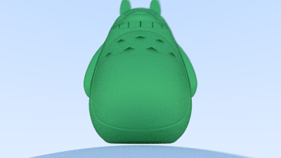
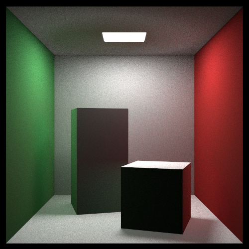

# ray_tracingin_one_weekend
    make Run1

#Exampel
1. 

###cornellbox

2. 

#球面采样
http://corysimon.github.io/articles/uniformdistn-on-sphere/
https://000ddd00dd0d.github.io/2019/04/07/Spherical-Sampling/
https://mathworld.wolfram.com/SpherePointPicking.html